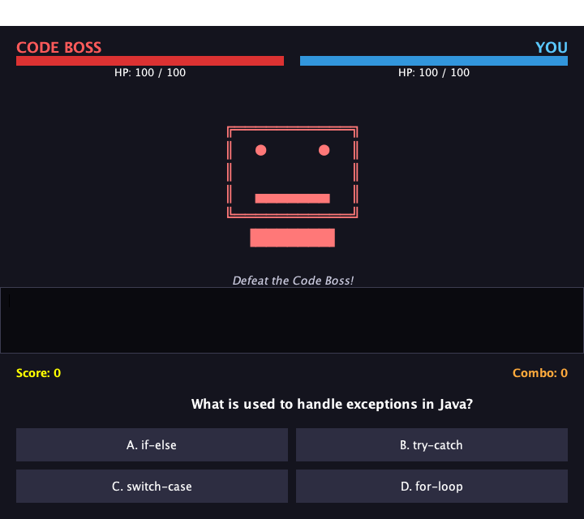

# BIT1123 Object Oriented Programming (Java) — Assignment 1


A consolidated repository of all practical tutorial work completed for **BIT1123 Object Oriented Programming**, covering the fundamentals of object-oriented design in Java from basic syntax through to a complete Swing GUI application.

---

## Student Information

| Item | Detail |
|---|---|
| **Assignment Title** | Object-Oriented Programming Fundamentals in Java — Assignment 1 (Individual, 20%) |
| **Student Name** | Ali Sharif AbdulKadir Sharif |
| **Student ID** | 202505010493 |
| **Program** | BCSSE — Bachelor of Computer Science (Software Engineering) |
| **Class Code** | BIT1123 |

---

## Course Information

| Item | Detail |
|---|---|
| **Course Code** | BIT1123 / BISE2093 / DIT1113 |
| **Course Name** | Object Oriented Programming (Java) |
| **Faculty** | Faculty of Information Technology |
| **University** | City University Malaysia |
| **Campus** | Cyberjaya |
| **Lecturer** | Sir Nazmirul Izzad Bin Nassir |
| **Semester** | 2026/05 |

---

## Brief Course Description

BIT1123 introduces the object-oriented programming paradigm using Java. The course moves from procedural fundamentals — variables, control flow and methods — into the four pillars of OOP: **encapsulation, inheritance, polymorphism and abstraction**.

Later tutorials extend these ideas into practical application development: working with the Java Collections Framework, handling exceptions safely, reading and writing files, and finally building an event-driven graphical user interface with Swing. Each weekly tutorial builds directly on the previous one, so the repository reads as a progression from a single `System.out.println` in Week 1 to a fully interactive desktop application in Week 10.

---

## Repository Structure

```
ALI-SHARIF-ABDULKADIR-SHARIF--202505010493-JAVA-PROGRAMMING/
│
├── README.md                  Project documentation (this file)
├── LICENSE                    MIT License
├── run_week10.sh              Helper script to compile and launch the Week 10 GUI
│
├── week1/                     Java basics, variables, control flow
│   ├── HelloWorld.java
│   └── StudentGrade.java
│
├── week2/                     Classes, objects and constructors
│   ├── Student.java
│   └── Mean.java
│
├── week3-4/                   Inheritance and polymorphism
│   ├── Person.java
│   ├── Student.java
│   ├── Lecturer.java
│   └── Main.java
│
├── week5/                     Encapsulation with getters and setters
│   ├── Student.java
│   └── Main.java
│
├── week6/                     Inheritance with protected members
│   ├── Employee.java
│   ├── Lecturer.java
│   └── Main.java
│
├── week7/                     Abstraction and abstract classes
│   ├── Appliance.java
│   ├── WashingMachine.java
│   ├── Refrigerator.java
│   ├── AirConditioner.java
│   └── Main.java
│
├── week8-9/                   Collections, file I/O and exception handling
│   ├── Main.java
│   └── task.txt
│
└── week10/                    Swing GUI mini project — "Code Boss Battle"
    ├── QuizBattleGUI.java
    ├── Questions.java
    ├── QuizBattleScreenshot.java
    └── quiz_screenshot.png
```

Folder naming follows a single consistent convention (`week1` … `week10`), with combined folders where a tutorial ran across two weeks (`week3-4`, `week8-9`).

---

## Tutorial Summary (Week 1–10)

### Week 1 Java Fundamentals
The entry point into Java: writing and compiling a first program, declaring variables of each primitive type, and using operators, conditionals and loops. `StudentGrade.java` applies these basics to a real task, looping over an array of subject marks, computing a total and average, and mapping each mark onto a letter grade through a reusable static method.

**Concepts:** `main` method · primitive types · `String` · operators · `if`/`else` · `for` loops · arrays · static methods · `printf` formatting

---

### Week 2 Classes and Objects
The first step into object orientation. `Student` is defined as a blueprint with attributes, a constructor that initialises them, and behaviours expressed as instance methods. `Mean.java` then instantiates multiple `Student` objects to show that each carries its own independent state.

**Concepts:** class definition · attributes · constructors · instance methods · object instantiation with `new`

---

### Week 3–4 Inheritance and Polymorphism
A `Person` superclass is extended by `Student` and `Lecturer`, each overriding `introduce()` with its own implementation. `Main.java` stores all three as `Person` references and calls the same method on each — demonstrating that Java resolves the call against the actual object type at runtime, not the declared reference type.

**Concepts:** `extends` · `super()` · method overriding · `@Override` · upcasting · runtime polymorphism (dynamic dispatch)

---

### Week 5 Encapsulation
The `Student` class is rewritten with all fields marked `private` and access routed exclusively through public getters and setters. This tutorial makes the case for information hiding: internal representation stays under the class's control, and the public surface becomes a deliberate contract.

**Concepts:** `private` fields · getters and setters · information hiding · `this` keyword

---

### Week 6 Inheritance with Protected Members
An `Employee` base class exposes `protected` fields so that its `Lecturer` subclass can use them directly, while they stay hidden from unrelated classes. The subclass adds its own state (`subject`, `department`) and its own methods on top of the inherited behaviour.

**Concepts:** `protected` access · constructor chaining with `super` · extending inherited behaviour

---

### Week 7 Abstraction
`Appliance` is declared `abstract` with a concrete shared implementation (`turnOn`, `turnOff`, `displayBrand`) and one abstract method, `operate()`, that every subclass must define for itself. `WashingMachine`, `Refrigerator` and `AirConditioner` each supply their own behaviour, and `Main.java` drives them all through the common `Appliance` type.

**Concepts:** `abstract` classes · abstract methods · enforced contracts · programming to a supertype

---

### Week 8–9 Collections, File I/O and Exception Handling
A task manager that reads user input with `Scanner`, stores entries in an `ArrayList<String>`, writes them to `task.txt` with a `BufferedWriter`, and reads them back with a `BufferedReader`. All file operations use try-with-resources so streams close automatically, and `IOException` is handled explicitly rather than allowed to crash the program.

**Concepts:** `ArrayList` · generics · `Scanner` · `BufferedWriter` / `BufferedReader` · try-with-resources · `IOException` handling

---

### Week 10 Swing GUI Mini Project: *Code Boss Battle*
The capstone tutorial — a complete event-driven desktop application that turns a Java quiz into a turn-based boss fight. Answering correctly damages the boss, with consecutive correct answers building a combo streak that raises the chance of a critical hit; a wrong answer costs the player HP.



The design brings together every concept from the earlier weeks: `Questions` is an encapsulated model class with a static factory that builds and shuffles the question bank, while `QuizBattleGUI` extends `JFrame` and composes the interface from nested layout panels. `QuizBattleScreenshot` renders the live window to a PNG, which is how the image above was produced.

**Concepts:** `JFrame` · `JPanel` · `BorderLayout` / `GridLayout` · `JButton` · `JProgressBar` · `ActionListener` via lambdas · `javax.swing.Timer` animation · `JOptionPane` dialogs · separation of model and view

The GUI also detects a headless environment and falls back to an automated console simulation, so it still runs in terminals and CI environments with no display attached.

---

## Technologies Used

| Technology | Purpose |
|---|---|
| **Java SE 17+** | Core language for all tutorials (developed and tested on OpenJDK 26) |
| **Swing / AWT** | Graphical user interface and 2D rendering in Week 10 |
| **Java Collections Framework** | `ArrayList` and `List` for dynamic data storage |
| **java.io** | File reading and writing in Week 8–9 |
| **javac / java** | Command-line compilation and execution |
| **Git & GitHub** | Version control and repository hosting |
| **Visual Studio Code** | Primary development environment |
| **Bash** | `run_week10.sh` build-and-launch helper |

---

## How to Run the Projects

### Prerequisites

Java Development Kit 17 or newer:

```bash
java -version
javac -version
```

### Clone the repository

```bash
git clone https://github.com/SHAFOO11/ALI-SHARIF-ABDULKADIR-SHARIF--202505010493-JAVA-PROGRAMMING.git
```

### General pattern

Every week folder is self-contained and uses the default package, so each one compiles and runs the same way — compile the folder, then run the class that contains `main`:

```bash
javac week1/*.java -d out/week1
java -cp out/week1 HelloWorld
```

### Week-by-week commands

| Week | Compile | Run |
|---|---|---|
| 1 | `javac week1/*.java -d out/week1` | `java -cp out/week1 HelloWorld`<br>`java -cp out/week1 StudentGrade` |
| 2 | `javac week2/*.java -d out/week2` | `java -cp out/week2 Mean` |
| 3–4 | `javac week3-4/*.java -d out/week3-4` | `java -cp out/week3-4 Main` |
| 5 | `javac week5/*.java -d out/week5` | `java -cp out/week5 Main` |
| 6 | `javac week6/*.java -d out/week6` | `java -cp out/week6 Main` |
| 7 | `javac week7/*.java -d out/week7` | `java -cp out/week7 Main` |
| 8–9 | `javac week8-9/*.java -d out/week8-9` | `java -cp out/week8-9 Main` |
| 10 | `javac week10/*.java -d out/week10` | `java -cp out/week10 QuizBattleGUI` |

> **Week 8–9** is interactive — it prompts for three tasks and writes them to `task.txt` in the current working directory.

### Week 10 shortcut

```bash
./run_week10.sh
```

To regenerate the screenshot from the live window:

```bash
java -cp out/week10 QuizBattleScreenshot week10/quiz_screenshot.png
```

---

## Reflection Summary

Working through these ten tutorials changed how I approach writing code. The early weeks were about syntax — getting a program to compile and produce the right output. From Week 2 onward the emphasis shifted to *design*: deciding what a class should be responsible for, what it should expose, and what it should keep to itself.

The concept that took longest to click was polymorphism. Writing the Week 3–4 exercise and watching three `Person` references each print a different message made the idea concrete in a way reading about it had not. Encapsulation in Week 5 felt like unnecessary overhead at first, until refactoring in later weeks showed how much easier a class is to change when nothing outside it depends on its internals.

Week 10 was where the separate pieces became one system. Building *Code Boss Battle* required a model class, a view built from composed Swing components, event handling, and state that stays consistent as the user interacts — and every one of those needs traced back to something practised in an earlier week.

---

## Repository

**GitHub URL:** https://github.com/SHAFOO11/ALI-SHARIF-ABDULKADIR-SHARIF--202505010493-JAVA-PROGRAMMING

---

## License

Released under the [MIT License](LICENSE).
